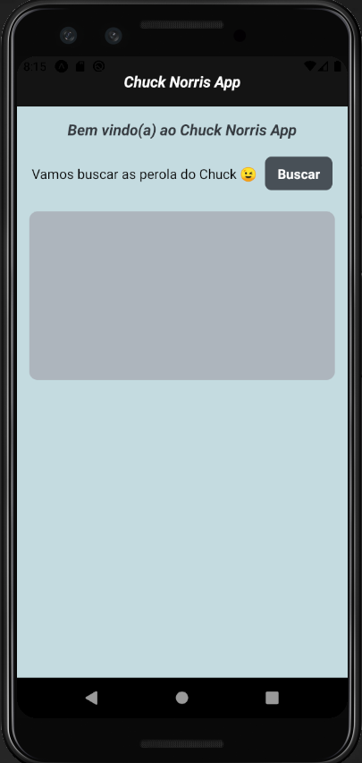
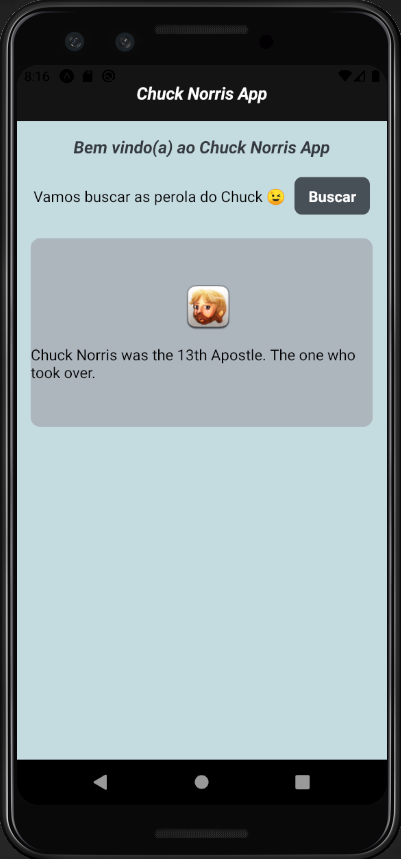

  <h1 align="center">Chuck Norris App</h1>

<!-- Getting Started -->

## INICIANDO O PROJETO

Para instalar o projeto em sua maquina siga os passos abaixo.

### INSTALAÇÃO

1. Clone o repositório

   ```sh
   git clone https://github.com/NiloMarcos/ChuckNorrisApp.git
   ```

2. Entre na pasta

   ```sh
   cd ChuckNorrisApp
   ```

3. Instale as dependências

   ```sh
   yarn
   ```

   ou

   ```sh
   npm i

### Fotos da aplicação

<div align="center">
   
   
</div>
